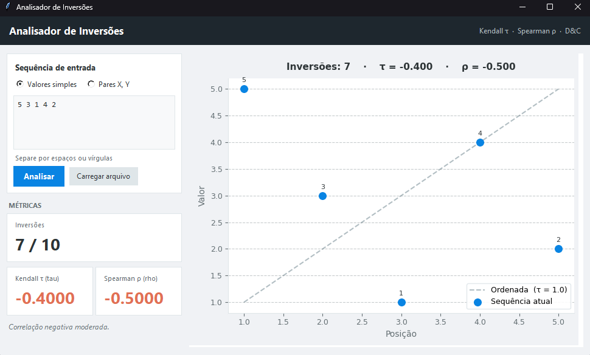
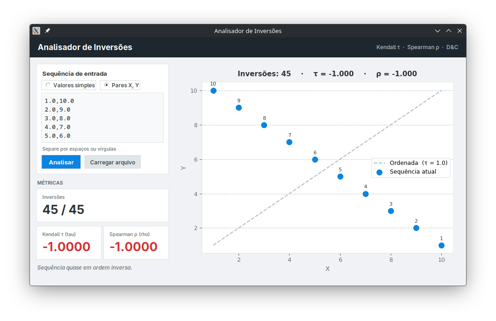
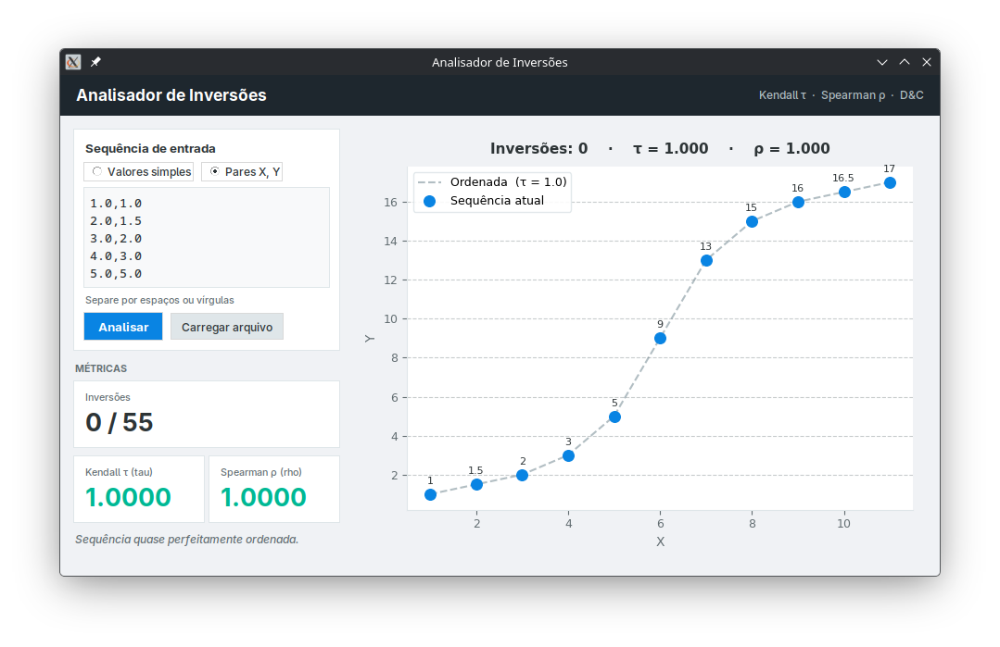
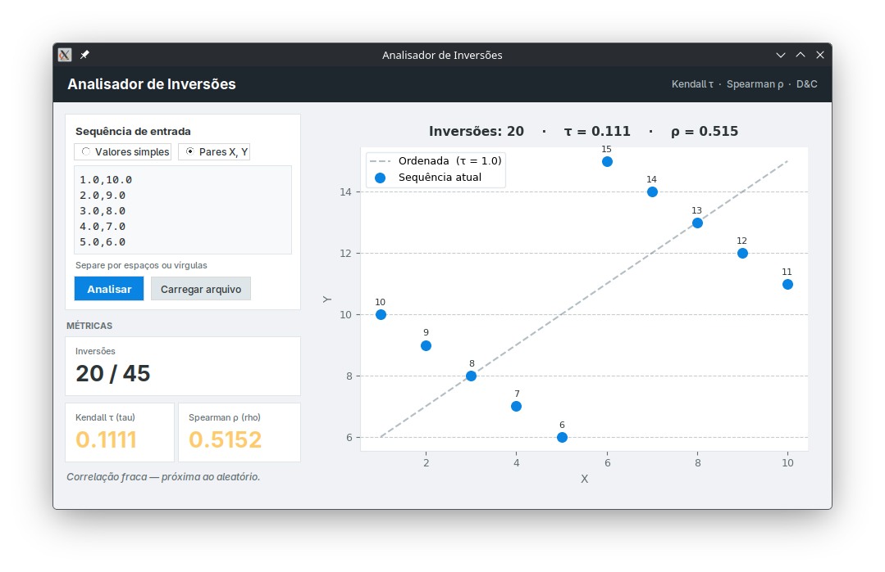
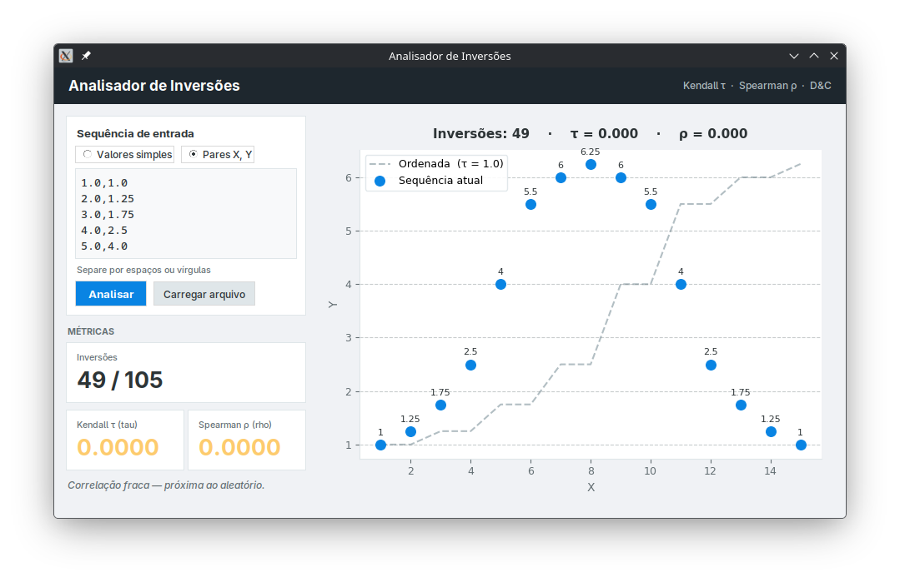
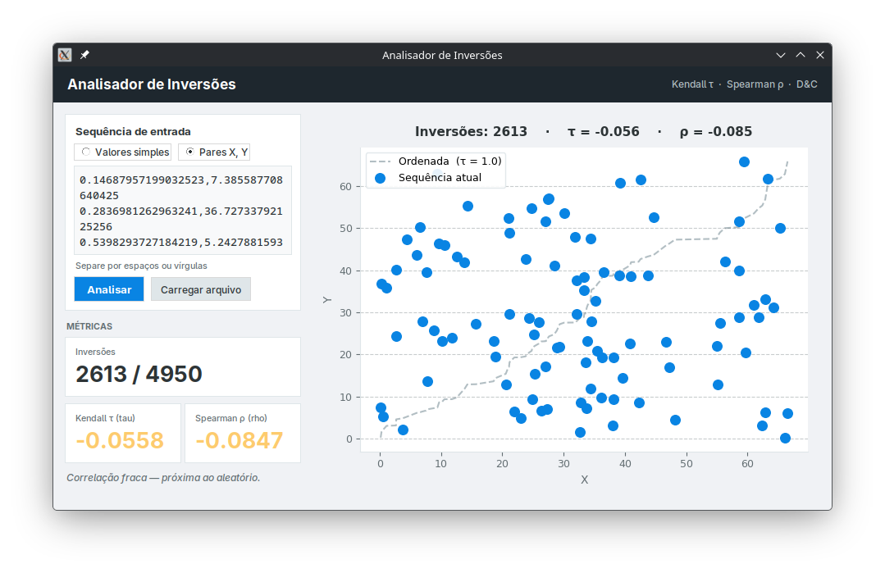

# Plot Analizer

**Número da Lista:** 37<br>
**Conteúdo da Disciplina:** Dividir e conquistar (D&C)<br>

[Apresentação](https://youtu.be/ba6tTINwxD4)

## Alunos
| Matrícula | Aluno |
| -- | -- |
| 21/1029512  |  Laís Cecília Soares Paes |
| 22/1008697  |  Sunamita Vitória Rodrigues dos Santos |

## Sobre

Aplicação que recebe uma sequência de pontos (X, Y) e calcula, com base nos valores de Y ordenados por X:

- **Número de inversões** — contagem de pares (i, j) onde i < j mas Y[i] > Y[j], usando um algoritmo de divisão e conquista baseado em Merge Sort (O(n log n))
- **Coeficiente de Kendall τ (tau-b)** — mede a correlação entre a ordem dos elementos e a ordem ideal (sequência crescente); τ = 1 indica ordenação perfeita, τ = −1 indica ordem inversa
- **Coeficiente de Spearman ρ (rho)** — correlação de Pearson aplicada sobre os ranks dos valores; equivalente ao tau mas com escala diferente

A interface exibe o número de inversões no formato `atual / máximo`, onde o máximo é n(n−1)/2 (sequência completamente invertida).

## Screenshots













## Instalação

**Pré-requisito:** Python 3.10+ com `matplotlib`.

```bash
pip install matplotlib
```

## Uso

**Interface gráfica** (recomendado):

```bash
python gui.py
```

- **Valores simples** — insira uma sequência separada por espaços ou vírgulas (ex: `5 3 1 4 2`); o X é atribuído automaticamente como posição (1, 2, 3…)
- **Pares X, Y** — insira um par por linha (ex: `1.5 3`); aceita vírgula ou espaço como separador
- Clique em **Analisar** ou use **Carregar arquivo** para abrir um `.txt`

**Linha de comando:**

```bash
python main.py entradas/entrada.txt
```

Formato do arquivo de entrada — um par X Y por linha:

```
1 5
2 3
3 1
4 4
5 2
```

## Outros

O algoritmo de contagem de inversões é uma adaptação do Merge Sort: ao realizar o merge de dois subarrays já ordenados, cada vez que um elemento do subarray direito precede um elemento do subarray esquerdo, isso representa inversões equivalentes ao número de elementos restantes no subarray esquerdo. Isso permite contar todas as inversões em O(n log n) em vez de O(n²).
